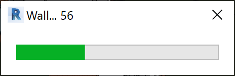
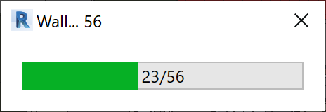

# RevitAddin_ProgressBar

Simple ProgressBar created using WPF.

## ProgressBarView.xaml
 

```C#
var count = 1000;
using (var progressBarView = new ProgressBarView($"Title", count))
{
    progressBarView.Show();
    for (int i = 0; i < count; i++)
    {
        // Do something
        if (progressBarView.Update()) break;
    }
}
```

### Vídeo

[![VideoIma]][Video]

 ## ProgressBarView2.xaml
 

```C#
using (var progressBar2View = new ProgressBar2View())
{
    var count = 1000;
    progressBar2View.Run($"Title", count, (i) =>
    {
        // Do Something
    });
}
```

### Vídeo2

[![VideoIma2]][Video2]

## License

This library is [licensed](LICENSE) under the [MIT Licence](https://en.wikipedia.org/wiki/MIT_License).

---

Do you like this project? Please [star this project on GitHub](https://github.com/ricaun/RevitAddin_ProgressBar/stargazers)!

[Video]: https://youtu.be/0GL90GI59VA
[VideoIma]: https://img.youtube.com/vi/0GL90GI59VA/hqdefault.jpg

[Video2]: https://youtu.be/lpEIA1ad20E
[VideoIma2]: https://img.youtube.com/vi/lpEIA1ad20E/hqdefault.jpg